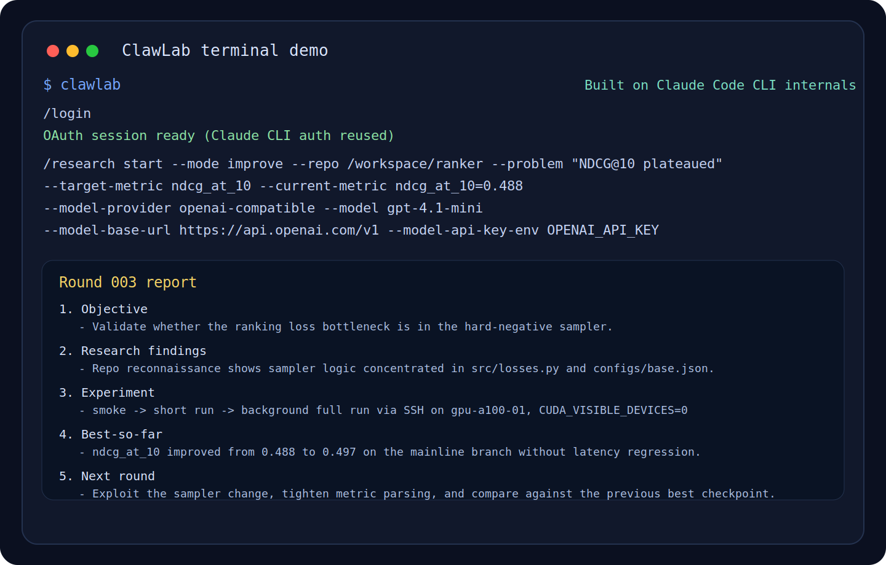

<p align="center">
  
</p>

<h1 align="center">ClawLab</h1>

<p align="center">
  <a href="./docs/auto-research-loop/README.en.md">
    
  </a>
  <a href="./docs/auto-research-loop/README.zh-CN.md">
    
  </a>
</p>

<p align="center">
  <a href="https://youjunzhao.github.io/ClawLab/">
    
  </a>
</p>

ClawLab is a persistent Auto Research Loop system built on top of a Claude Code CLI source snapshot. It is designed for real repo work: topic-driven research, existing-project improvement, SSH/GPU experiments, and now a practical rebuttal workflow.

## What works now

These are the parts that are actually implemented and runnable in this repo today:

- `new_project` and `existing_project_improvement` research missions via `/research start`
- explicit state-machine-driven research loop under `src/research/**`
- local + SSH executor support for experiments
- model routing for `auto`, `anthropic_oauth`, `anthropic_api_key`, and `openai_compatible`
- native integration inspection/scaffolding for Codex, Claude Code, and OpenClaw
- a local rebuttal pipeline that reads paper/review files, scans repo evidence, applies venue policies, and drafts rebuttal artifacts
- a small executable local skill catalog that can be listed, shown, and run

## Important reality check

These are deliberately **not** overstated:

- `/research team ...` is currently team scaffolding and role guidance, not a full embedded OMX runtime
- the rebuttal pipeline is artifact-first and locally runnable, but model-assisted drafting still depends on whatever model auth/provider is actually configured on your machine
- the repo-wide TypeScript baseline is still noisy because this source snapshot contains many unrelated upstream issues; the focused ClawLab tests are the reliable verification path right now

## Install

```bash
bun install
bun src/entrypoints/cli.tsx
```

Or use the binary alias:

```bash
clawlab
```

If you want Anthropic OAuth-backed model access inside the CLI:

```bash
/login
```

## Setup

Initialize the local scaffold once:

```bash
/research setup
```

This creates:

- `.clawlab/tasks/`
- `.clawlab/docs/`
- `.clawlab/memory/`
- `.clawlab/team/`
- `.clawlab/skills/`
- `.clawlab/rebuttal/`
- `.clawlab/integrations/`

## Research workflows

### 1. Start from a topic

```bash
/research start --mode new "test-time adaptation for multimodal agents"
```

### 2. Improve an existing project

```bash
/research start \
  --mode improve \
  --repo /path/to/project \
  --problem "validation F1 is stuck around 0.72 after epoch 3" \
  --target-metric f1 \
  --current-metric f1=0.72 \
  --goal "push F1 beyond 0.76 without a large inference-cost regression"
```

### 3. Summarize only when you explicitly want it

```bash
/research summarize report
/research summarize summary
/research summarize paper
```

## Native integrations

ClawLab now has a real integration layer for three external ecosystems:

- `codex`
- `claude-code`
- `openclaw`

Commands:

```bash
/research integration status
/research integration doctor
/research integration doctor codex
/research integration init codex
/research integration init claude-code
/research integration init openclaw
```

What it does:

- detects CLI availability on `PATH`
- checks user-level config locations
- checks whether project-local adapter files exist
- performs conservative auth detection where that is statically safe
- writes project-local adapter templates under `.codex/`, `.claude/`, and `.openclaw/`

Current auth detection policy is intentionally conservative:

- Codex: detects `auth.json` or `OPENAI_API_KEY`
- Claude Code: can confirm env-backed auth, but does **not** claim an interactive Claude login is valid from static files alone
- OpenClaw: checks config/profile signals, not live gateway liveness

## Rebuttal workflow

ClawLab now includes a runnable rebuttal path.

### Initialize rebuttal workspace

```bash
/research rebuttal init
```

### Build a rebuttal plan

```bash
/research rebuttal plan \
  --paper /path/to/paper.pdf \
  --review /path/to/review1.pdf \
  --review /path/to/review2.txt \
  --repo /path/to/repo \
  --venue neurips
```

### Draft from an existing rebuttal run

```bash
/research rebuttal draft --run-dir /path/to/.clawlab/rebuttal/runs/run_...
```

### Validate a draft against venue rules

```bash
/research rebuttal validate --draft /path/to/rebuttal_draft.md --venue neurips
```

Current built-in venue presets:

- `cvpr`
- `neurips`
- `iclr`
- `acl_arr`
- `generic`

Artifacts written per rebuttal run:

- `inputs.json`
- `paper.txt`
- `reviews.txt`
- `venue_policy.json`
- `concerns.json`
- `repo_evidence.json`
- `rebuttal_plan.json`
- `rebuttal_plan.md`
- `rebuttal_draft.md`
- `rebuttal_validation.json`

## Executable local skills

ClawLab now exposes a small executable skill catalog instead of a giant fake list.

Commands:

```bash
/research skills list
/research skills show integration-doctor
/research skills run integration-doctor
/research skills run review-concern-extract --review /path/to/review.pdf
/research skills run venue-policy-check --draft /path/to/draft.md --venue neurips
```

Current executable built-ins:

- `integration-doctor`
- `review-concern-extract`
- `venue-policy-check`
- `repo-evidence-scan`
- `rebuttal-plan`

Curated external references are also listed, but they are clearly marked as references rather than pretending to be built-in local skills.

## Team scaffolding

The current `/research team ...` surface is still useful, but be clear about what it is:

- role scaffolding
- team memory templates
- role switch/status commands
- role-oriented playbook recommendations

It is **not** the same thing as a fully embedded OMX `$team` runtime.

Available commands:

```bash
/research team init
/research team status
/research team roles
/research team switch reviewer
/research team skills --stage experiment
```

## Validation

These are the verification commands that currently give reliable signal for ClawLab work in this repo:

```bash
bun run lint:clawlab
bun run test:clawlab
bun run check:clawlab
```

What I have actually verified in this environment:

- `bun run test:clawlab` passes
- `bun run lint:clawlab` passes with complexity warnings only

The focused `typecheck:clawlab` script is still limited by inherited upstream TypeScript graph issues from this repository snapshot, so I do not treat it as the main pass/fail gate yet.

## External references used for this direction

- [OpenAI Codex docs](https://developers.openai.com/codex/)
- [OpenAI Codex GitHub repo](https://github.com/openai/codex)
- [Claude Code docs](https://code.claude.com/docs/en/quickstart)
- [Anthropic Claude Code docs](https://docs.anthropic.com/en/docs/claude-code/overview)
- [OpenClaw docs](https://docs.openclaw.ai/)
- [OpenClaw GitHub repo](https://github.com/openclaw/openclaw)
- [oh-my-codex](https://github.com/Yeachan-Heo/oh-my-codex)
- [oh-my-claudecode](https://github.com/Yeachan-Heo/oh-my-claudecode)
- [Paper2Rebuttal](https://github.com/AutoLab-SAI-SJTU/Paper2Rebuttal)

## More documentation

- English guide: [docs/auto-research-loop/README.en.md](./docs/auto-research-loop/README.en.md)
- 中文指南: [docs/auto-research-loop/README.zh-CN.md](./docs/auto-research-loop/README.zh-CN.md)
- Docs landing page: [docs/auto-research-loop/README.md](./docs/auto-research-loop/README.md)
